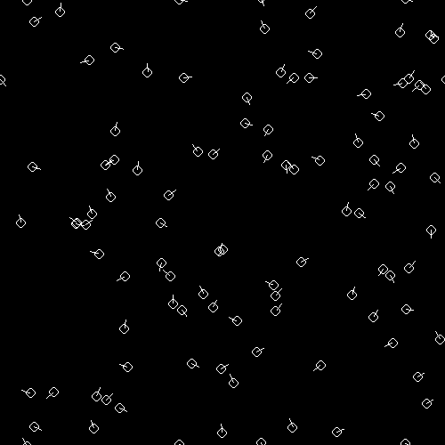
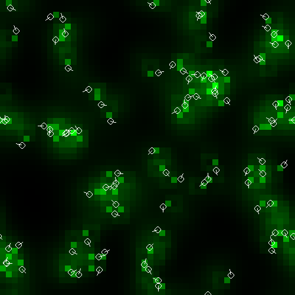
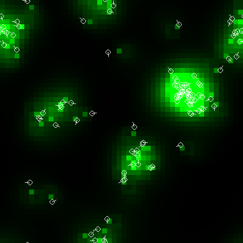
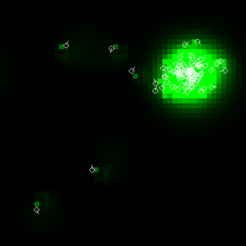

# CROCO

StarLOGO inspired agent based simulation framework

## Examples

### Slime mold

Each agent (mold cell)
follows a simple set of rules:

1. Drop some pheromone on the current patch
2. “Wiggle” (turn a little bit in a random direction)
3. “Sniff” in three directions (left, forward, right)
   and move in the direction where the pheromone level is highest

After each tick the pheromone spreads to the surrounding cells
and “evaporates” (`level *= 0.9`)

At the beginning, the cells are distributed randomly

They start forming small groups

And after a while only a few large groups remain

